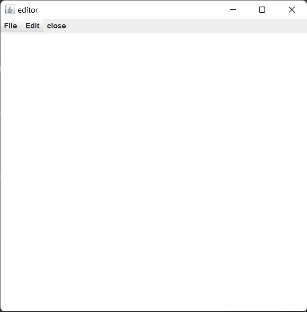

# text-editor-java
A Text Editor app made using Java Swing and AWT packages

## Steps to Run this Project
1. Download or Clone this Repository. 
2. Now, ensure that java has been installed on your PC & path is set.
3. Now, either Run the Project from any IDE
4. Or Run using cmd as :- 
    ### javac editor.java
    ### java editor
    
## Project snapshots

